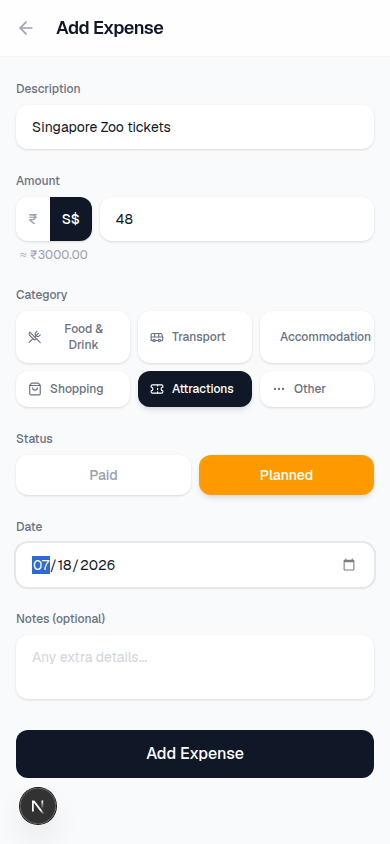

# TripKharcha

A minimal, mobile-first expense tracker for your Singapore trip. Track paid and planned expenses in INR with automatic SGD conversion.

## Screenshots

<p align="center">
  
  
  
</p>

## Features

- Multi-user authentication (register + login)
- Track expenses as **Paid** or **Planned**
- Multi-currency support (INR primary, SGD with auto-conversion)
- Filter by status (All / Paid / Planned)
- Categories: Food, Transport, Accommodation, Shopping, Attractions, Other
- Summary cards with real-time totals
- Mobile-first responsive design
- Modern minimalist UI with Geist font

## Tech Stack

- **Next.js 15** (App Router, Server Components, Server Actions)
- **React 19** + **TypeScript**
- **Tailwind CSS v4**
- **SQLite** + **Drizzle ORM**
- **NextAuth.js v5** (credentials provider, bcrypt)
- **Lucide React** (icons)

## Getting Started

### Prerequisites

- Node.js 18+
- npm

### Installation

```bash
git clone https://github.com/ninjashari/sgd-expense-tracker.git
cd sgd-expense-tracker
npm install
```

### Environment Variables

Create a `.env.local` file:

```env
AUTH_SECRET=your-random-secret-min-32-characters
DATABASE_PATH=./data/expenses.db
```

### Database Setup

```bash
npx drizzle-kit push
```

### Run Development Server

```bash
npm run dev
```

Open [http://localhost:3000](http://localhost:3000) and create an account to get started.

## Deployment (Render)

1. Create a **Web Service** on [Render](https://render.com)
2. Connect your GitHub repository
3. Configure:

| Setting | Value |
|---------|-------|
| Build Command | `npm install && npx drizzle-kit push && npm run build` |
| Start Command | `npm start` |
| Persistent Disk | 1 GB, mount path: `/data` |

4. Add environment variables:

| Variable | Value |
|----------|-------|
| `DATABASE_PATH` | `/data/expenses.db` |
| `AUTH_SECRET` | *(generate a random 32+ character string)* |

## License

MIT
